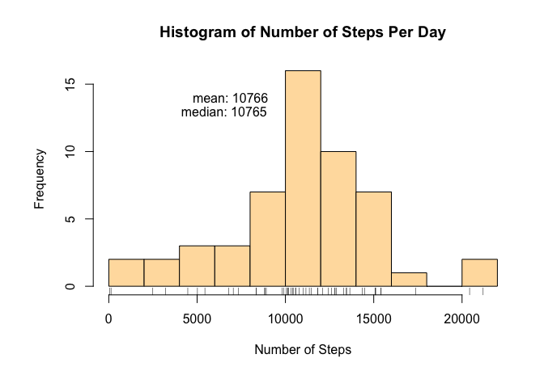
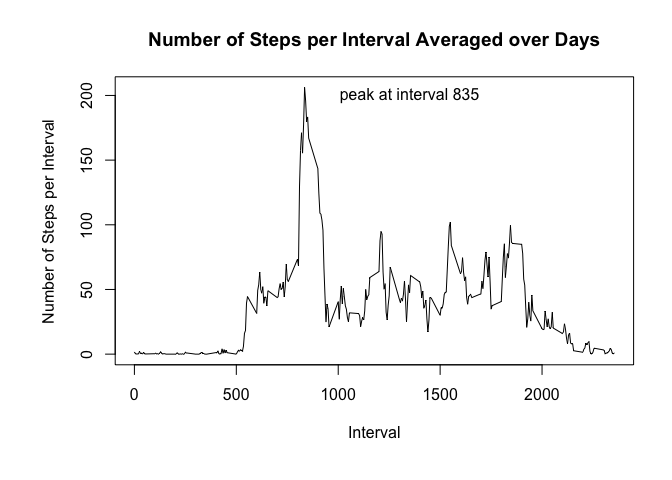
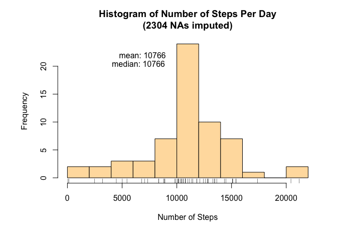
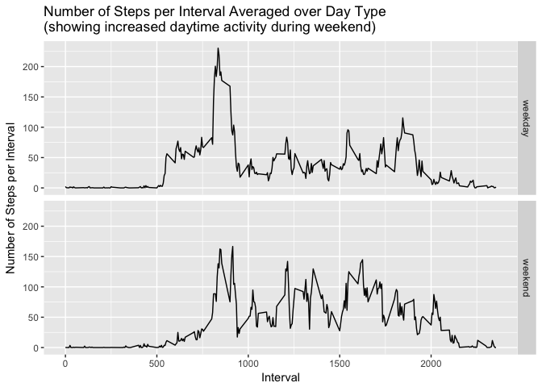

# Reproducible Research: Peer Assessment 1
In this report, a data set representing steps taken by a person in every 5 minute interval is analyzed.  The data set represents two months of data collection with the 5-minute interval measurements and shows actitivity of a person over the two months period.  Key questions regarding activity pattern depending on various parameters are analyzed and shown.  R code sections used for the analyses are shown, as well as the output (graphs) of the code.

## Loading and preprocessing the data
For the analysis, the csv type data set is loaded via the code shown below.  Libraries required for the subsequent analysis sections are also loaded.


```r
# load necessary libraries and data
require(dplyr)
```

```
## Loading required package: dplyr
```

```
## 
## Attaching package: 'dplyr'
```

```
## The following objects are masked from 'package:stats':
## 
##     filter, lag
```

```
## The following objects are masked from 'package:base':
## 
##     intersect, setdiff, setequal, union
```

```r
require(lubridate)
```

```
## Loading required package: lubridate
```

```
## 
## Attaching package: 'lubridate'
```

```
## The following object is masked from 'package:base':
## 
##     date
```

```r
require(ggplot2)
```

```
## Loading required package: ggplot2
```

```r
# unzip and read csv file
activity <- read.csv(unzip("activity.zip"), stringsAsFactors = FALSE)
```

## What is mean total number of steps taken per day?
The total number of steps taken over a day is averaged over the days of the two month period to calcuate the mean total number of steps taken per day.  The R code for the analysis is shown below, followed by the graph output.  NAs (missing values) have been excluded from the total number calculation.  Mean of the distribution of the number of steps is 10766 and the median is very close to the mean at 10765.


```r
# convert to table dataframe, remove NAs, group by date, calculate sums
daily.steps.sum <- tbl_df(activity)             %>%
                   filter(!is.na(steps))        %>%
                   group_by(date)               %>%
                   summarize(sum = sum(steps))
# base graphics
par(mfrow = c(1, 1), mar = c(6, 6, 4, 2))
hist(daily.steps.sum$sum, breaks = 10, col  = 'navajowhite',
     xlab = "Number of Steps", main = "Histogram of Number of Steps Per Day")
rug(daily.steps.sum$sum)
text(6890, 14, paste("mean:", floor(mean(daily.steps.sum$sum))))
text(6530, 13, paste("median:", floor(median(daily.steps.sum$sum))))
```

<!-- -->

## What is the average daily activity pattern?
Detailed daily pattern of the steps taken over a day is averaged over the days of the two month period to calcuate the daily activity pattern.  R code for the analysis is shown below, followed by the graph output.  NAs (missing values) have been excluded from the calculation.  The graph shows that the peak number of steps (average value over the two month period) occurs at interval 835.


```r
# convert to table dataframe, remove NAs, group by date, calculate pattern
daily.pattern <- tbl_df(activity)               %>%
                 filter(!is.na(steps))          %>%
                 group_by(interval)             %>%
                 summarize(mean = mean(steps))
# base graphics
par(mfrow = c(1, 1), mar = c(6, 6, 4, 2))
plot(daily.pattern$interval, daily.pattern$mean, type = 'l',
     xlab = "Interval", ylab = "Number of Steps per Interval",
     main = "Number of Steps per Interval Averaged over Days")
peak.activity = max(daily.pattern$mean)
peak.interval = daily.pattern$interval[daily.pattern$mean == peak.activity]
text(1350, 200, paste("peak at interval", peak.interval))
```

<!-- -->

## Imputing missing values
The total number of steps taken over a day is calculated again, averaged over the days of the two month period to calcuate the mean total number of steps taken per day.  In this analysis section, each NA is replaced with the mean value of the 5-minute interval in which the NA value is found. The R code for the analysis is shown below, followed by the graph output.  Mean of the distribution of the number of steps is 10766 and the median is equal to the mean at 10766, and these values show that the imputation only insignificantly affected the overall statistics.  Upon a closer examination of the graph,  the frequency at the peak is enhanced noticeably compared to the first graph showing a result with excluded NAs.


```r
# fill in NA values with averages of corresponding intervals
# calculate imp.activity from daily.pattern calculated earlier
impute <- merge(tbl_df(activity), daily.pattern, "interval") %>%
                group_by(date)
impute$steps[is.na(impute$steps)] = impute$mean[is.na(impute$steps)]
# same as original data but with NAs filled with
# avarages of corresponding intervals
imputed.activity <- select(impute, -mean)
# calculate daily sum
daily.steps.sum <- summarize(imputed.activity, sum = sum(steps))
# base graphics
par(mfrow = c(1, 1), mar = c(6, 6, 4, 2))
hist(daily.steps.sum$sum, breaks = 10, col  = 'navajowhite',
     xlab = "Number of Steps",
     main = paste0("Histogram of Number of Steps Per Day\n(",
                   sum(is.na(activity$steps)), " NAs imputed)"))
rug(daily.steps.sum$sum)
text(6865, 22.0, paste("mean:", floor(mean(daily.steps.sum$sum))))
text(6500, 20.5, paste("median:", floor(median(daily.steps.sum$sum))))
```

<!-- -->

## Are there differences in activity patterns between weekdays and weekends?
The detailed daily pattern of the steps taken over a day is averaged over the days of the two month period and day type (i.e. weekday or weekend) to calcuate the daily activity pattern that depends on the type of day.  R code for the analysis is shown below, followed by the graph output.  This analysis used the imputed data set of the previous section.

The panel of graph shows that there is a difference between the activity patterns of weekdays and weekend.  In particular, it can be inferred from a comparison that the peak occuring at around 835 is due to communuting to work on a week day.  This peak in activity is reduced during weekend.  Additionally, during the weekend, daytime activity is notably enhanced compared to that of a weekday, most likely because of the increased seated time during work.


```r
# assign day.type to dates and calculate means
# assign day.type to dates to the imputed data and calculate means 
day.type.pattern <-
    mutate(imputed.activity, day.week = weekdays(ymd(date)))                %>%
    mutate(day.type = ifelse(day.week == "Saturday" | day.week == "Sunday",
                            "weekend", "weekday"))                          %>%
    group_by(day.type, interval)                                            %>%
    summarize(mean = mean(steps))
# ggplot graphics
ggplot(day.type.pattern, aes(interval, mean)) +
    facet_grid(day.type ~ .) +
    geom_line() +
    xlab("Interval") + ylab("Number of Steps per Interval") +
    ggtitle(paste0("Number of Steps per Interval Averaged over Day Type\n",
                   "(showing increased daytime activity during weekend)"))
```

<!-- -->

## Conclusion
A data set representing a persons daily activity (steps) have been analyzed by examining activities averaged over days as well as type of days.  Analyses show that the mean of the total number of steps is about 10766 and there is a notable difference in the person's activity pattern depending on weekday or weekend.
